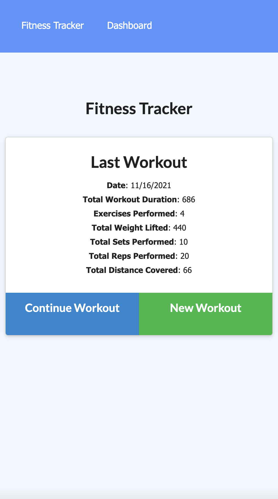
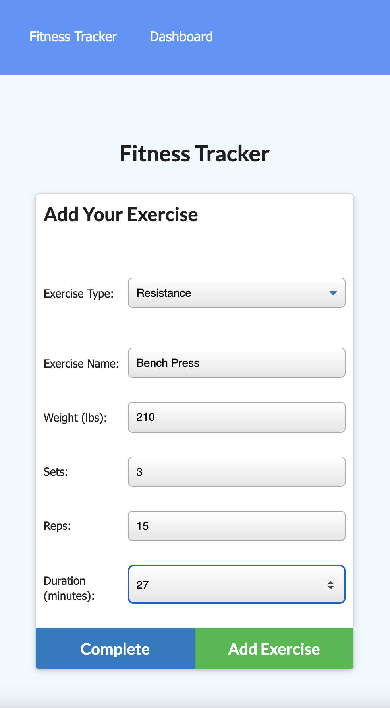
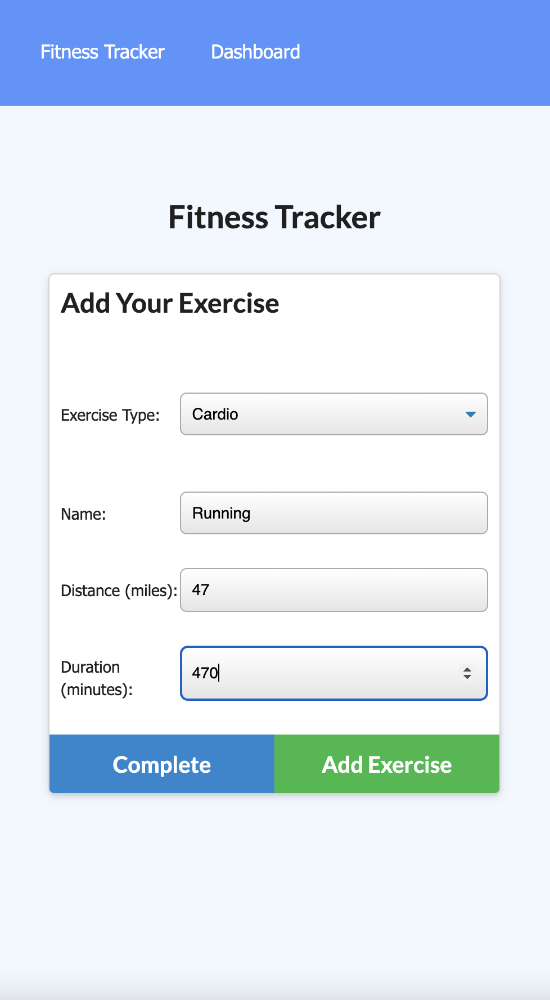
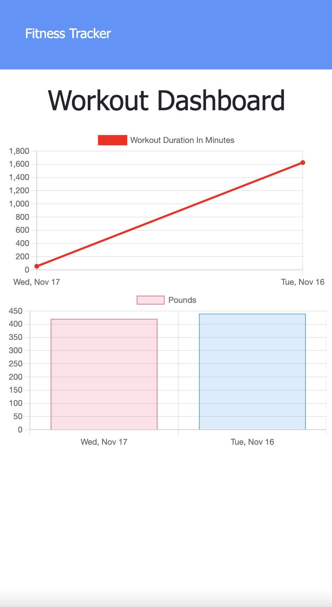

# NoSQL Workout Tracker 

## Description
A simple workout tracking app that uses MongoDB to store data.

## Table of Contents
- [NoSQL Workout Tracker]
  - [Description](#description)
  - [Table of Contents](#table-of-contents)
  - [Installation](#installation)
  - [Usage](#usage)
  - [Contributing](#contributing)
  - [License](#license)
  - [Questions](#questions)

## Installation
Visit the deplpoyed app [here!](https://dimiter-workout-tracker.herokuapp.com/)

## Usage
### Screenshots (Desktop and Mobile)

## Contributing
To contribute, contact me below!

## License
This application is covered under the MIT License

## Links
[Repository](https://github.com/dimitermusic/nosql-workout-tracker)  
[Deployed App](https://dimiter-workout-tracker.herokuapp.com/)

## Questions
If you have any questions, please visit my Github profile or email me using the links below:

[Github](https://github.com/dimitermusic)  
[Email](mailto:info@dimitermusic.com)